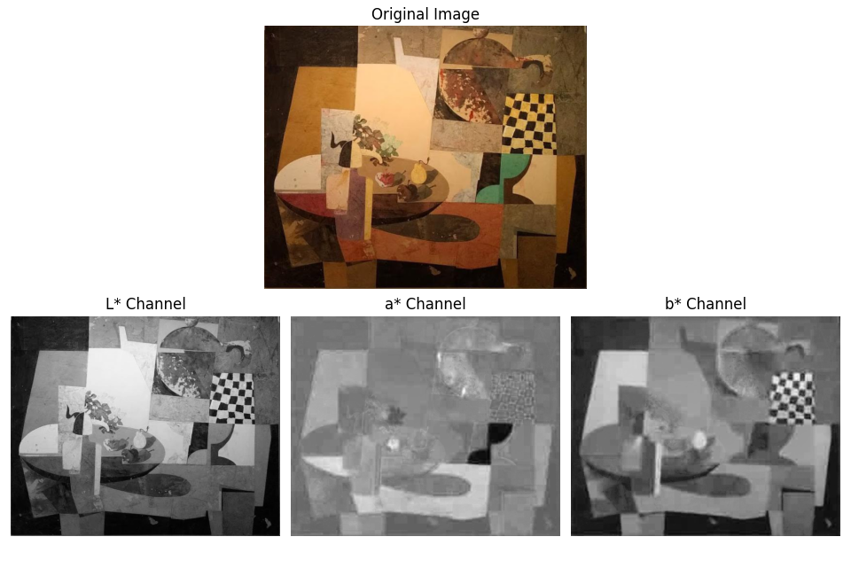
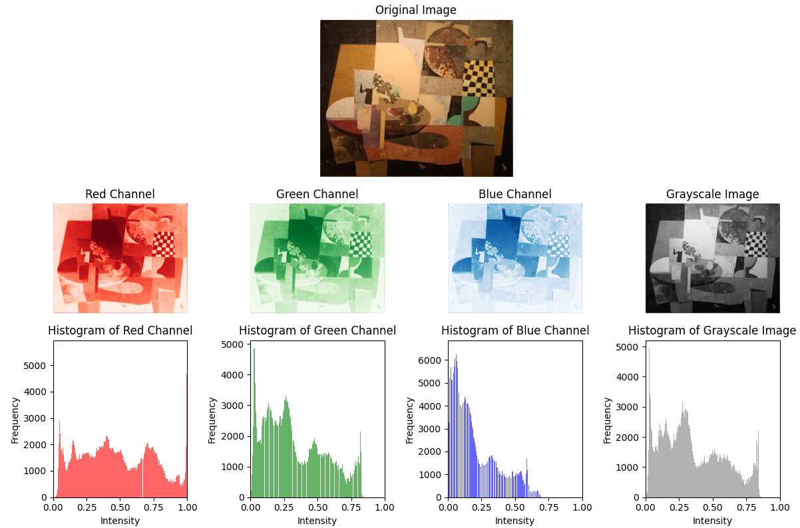

# Master Computer Vision, Module C1

## Code execution
### Install python and pip
```
sudo apt install python3
```
```
sudo apt install python3-pip
```

### Install dependencies
```
pip install -r requirements.txt
```

### Generate histograms
```
python create_histograms.py
```

### Run the main code
```
main.py \
--queries-hist-dir qst1_w1 \
--color-space LAB \
--similarity-measure Correlation \
--k-val 10 \
--results-file result.pkl
```

## Module C1 - Week 1
The goal of this week's task is to match pictures of paintings from a large image database with other image queries that feature those artworks. The resemblance between each query and each image in the database is assessed based on their visual content; specifically, the similarity between their histograms.

### Task 1
In task one, up to two methods could be chosen for computing the image descriptors (histograms). We decided to calculate all the histograms in advance for the following color representations: RGB, CIELAB, HSV, YCrCb, and Grayscale, so we could experiment if we wanted to. After the process of creation, the histograms are saved in pickle files. This is done by executing the ```create_histograms.py``` script and having the databases in the following directory:

```
./data
```
It is required to have downloaded the three DB (BBDD, qsd1_w1, qst1_w1) and to have placed them in ``data`` in order to execute the script. After the execution, the files will be distributed as the following:
```
./data/histograms/<DataBaseFolderName>/<ColorRepresentation>/<OriginalFileName>.pkl
```
 
However, the subsequent tasks require the choice of only two color representations. In our case, the selected ones have been CIELAB and a combination of RGB and Grayscale.

#### Method 1: CIELAB
CIELAB was chosen for its perceptual uniformity, allowing for more accurate color comparisons that align with human vision (as the perceived difference is proportional to the distance in the space).



% TODO podem posar també algun plot d'histogrames

#### Method 2: GRAY and RGB
In Method 2, we combine Grayscale and RGB representations. Grayscale focuses on intensity, highlighting textures and patterns, while RGB retains essential color information. This combination provides a balanced approach, leveraging texture and color details.



% TODO podem posar també algun plot d'histogrames

### Task 2
Task two consisted on choosing between different similarity measures that would be used to compute the likeliness of the histograms. The measure we chose is correlation.
% TODO no sé gaire què comentar de la correlation

#### Correlation
$d(H_1, H_2) = \frac{\sum_I (H_1(I) - \bar{H}_1)(H_2(I) - \bar{H}_2)}{\sqrt{\sum_I (H_1(I) - \bar{H}_1)^2 \sum_I (H_2(I) - \bar{H}_2)^2}}$

### Task 3
In task three, the similarity between the queries and all the images in the database is computed according to the described criteria in the two previous tasks. The top ``K`` predictions for each query (i.e., the indices of the ``K`` most similar histograms for each of the queries, sorted) are returned by the function ``generate_results()``. These results allow us to compute the mAP@K. The obtained values for the mAP@K with the pre-selected methods are the following:
|          | mAP@1 | mAP@5 |
|----------|-------|-------|
| Method 1 |       |       |
| Method 2 |       |       |

### Task 4
The creation of the submition for the blind competition is done in the ```main.py``` file. Remember to execute the file ```create_histograms.py``` before.

## New files
### distance_matrix.py
### histograms.py
### create_histogram.py
### main.py
## Extra functionalities

Aqui posem totes les coses extres que hem fet com lo de visualitzar histogrames i tota la pesca

* ```plot_histograms```: makes possible the visualization of the histogram extracted from an image. If there is more than one chanel the histograms appear in the same plot.