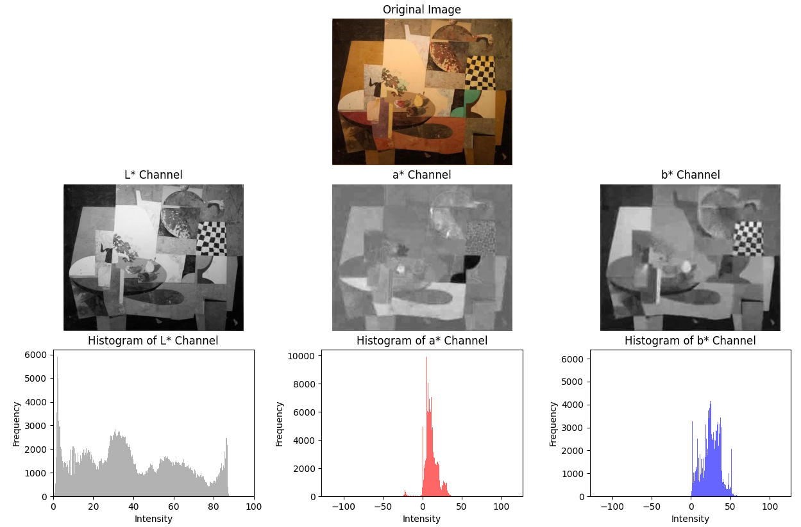

# Master Computer Vision, Module C1
# Week 1
[▶️ Code execution](#code-execution)

[💡 This week's tasks](#this-weeks-tasks)
- [Task 1](#task-1)
- [Task 2](#task-2)
- [Task 3](#task-3)
- [Task 4](#task-4)

[📂 Files in this project](#files-in-this-project)

<h2 id="code-execution">▶️ Code execution</h2>

### Clone the repository
```
git clone https://github.com/MCV-2024-C1-Project/Team7
```

### Move to the corresponding directory
```
cd Team7
```

### Install dependencies
```
pip install -r requirements.txt
```

### Organize datasets
By default, the scripts assume a specific structure: create a file named ``data`` at the top level of the repository. Then, place the datasets ``BBDD``, ``qsd1_w1`` and ``qst1_w1`` inside the folder ``data``. This structure can be modified if needed.

### Generate histograms
To generate the necessary 1D histograms to perform the comparisons between images, run:
```
python create_histograms.py
```
This will create a folder called ``histograms`` inside the ``data`` directory. The histograms are saved in ``.pkl`` format and organized in subfolders according to the dataset they come from and the type of histogram (gray, RGB, etc.).

### Run the main code
The arguments shown in the following command line are the ones by default (which correspond to [Method 1](#method-1-cielab)). Use ``python main.py -h`` to see all the possible arguments.
```
python main.py \
--queries-hist-dir qst1_w1 \
--color-space LAB \
--similarity-measure Correlation \
--k-val 10 \
--results-file results.pkl
```

<h2 id="this-weeks-tasks">💡 This week's tasks</h2>
The goal of this week is to match pictures of paintings from a large image database with other image queries that feature those artworks. The resemblance between each query and each image in the database is assessed based on their visual content; specifically, the similarity between their color histograms.

### Task 1
In task one, up to two methods could be chosen for computing the image descriptors (histograms). To decide which methods to use, we have carried out both theoretical and emprical explorations of the following 5 color representations: RGB, CIELAB, HSV, YCrCb, and Grayscale.

On one hand, the theoretical exploration has consisted in determining which color space is "best" in terms of their theoretical properties. In this case, "best" corresponds to the folling heuristic: the best color space will be the one with characteristics most similar to human perception.

On the other hand, for the emprical exploration, we decided to calculate all the histograms in advance for the following color representations: RGB, CIELAB, HSV, YCrCb, and Grayscale, as well as combinations of Grayscale and the other four, so we could experiment with them. After creating them, the histograms are saved in pickle files. This is done by executing the ``create_histograms.py`` script (it is required to have downloaded the three databases (BBDD, qsd1_w1, qst1_w1) and to have placed them in ``data`` in order to execute the script). After the execution, the files will be distributed as follows:
```
data/histograms/<DataBaseFolderName>/<ColorRepresentation>/<OriginalFileName>.pkl
```

Although the code in ``create_histograms.py`` generates the histograms for five different color spaces, as well as combinations of grey and other colors, the subsequent tasks require choosing only two methods. In our case, according to our theoretical and empirical explorations, the selected ones have been CIELAB and a combination of RGB and Grayscale.

#### Method 1: CIELAB
[CIELAB](https://en.wikipedia.org/wiki/CIELAB_color_space) was chosen for its perceptual uniformity, allowing for more accurate color comparisons that align with human vision (as the perceived difference is proportional to the distance in the space).

- __L* Channel__: Represents lightness, ranging from black (0) to white (100), showing the image's intensity without any color information.
- __a* Channel__: Encodes color information on a red-green axis, where negative values indicate green and positive values indicate red.
- __b* Channel__: Encodes color information on a blue-yellow axis, with negative values representing blue and positive values representing yellow.

The following figure represents the decomposition of an image in the three channels in CIELAB. The histograms below each channel visualize the distribution of intensity values for the respective components of the image.



#### Method 2: GRAY + RGB
In Method 2, we combine [Grayscale](https://en.wikipedia.org/wiki/Grayscale) and [RGB](https://en.wikipedia.org/wiki/RGB_color_model) representations. Grayscale focuses on intensity, highlighting textures and patterns, while RGB retains essential color information. This combination provides a balanced approach, leveraging texture and color details.

- __Red Channel__: Contains the intensity of red hues in the image. Brighter areas represent stronger red content.
- __Green Channel__: Represents the intensity of green hues, where brighter areas have more green content.
- __Blue Channel__: Shows the intensity of blue hues. Brighter areas indicate stronger blue content.
- __Grayscale Image__: A representation of the image where all color information is removed, focusing solely on brightness (light and dark areas) across the entire image.

As before, the figure below shows the RGB channels of an image and its grayscale version. The histograms illustrate the distribution of intensity values for each color or grayscale component.


### Task 2
Task two consisted on choosing between different similarity measures that would be used to compute the likeliness of the histograms. The measure we have chosen is correlation, which is defined as:

$$
d(H_1, H_2) = \frac{\sum_I (H_1(I) - \bar{H}_1)(H_2(I) - \bar{H}_2)}{\sqrt{\sum_I (H_1(I) - \bar{H}_1)^2 \sum_I (H_2(I) - \bar{H}_2)^2}}
$$

Even though our theoretical explorations pointed at Bhattacharyya as a well suited metric for this task, as it is tolerant to noise and outliers, correlation has proved to perform better after executing a set of emprical tests using `test_methods.py`.

### Task 3
In task three, the similarity between the queries and all the images in the database is computed according to the described criteria in the two previous tasks. The top ``K`` predictions for each query (i.e., the indices of the ``K`` most similar histograms for each of the queries, sorted) are returned by the function ``generate_results()``. These results allow us to compute the mAP@K. The necessary computations are encapsulated in ``test_methods.py``. The obtained values for the mAP@K with the pre-selected methods are the following:
|                                     |  mAP@1  |  mAP@5  |
|-------------------------------------|---------|---------|
| Method 1 (Correlation & CIELAB)     |  0.300  |  0.326  |
| Method 2 (Correlation & GRAY + RBG) |  0.300  |  0.351  |

### Task 4
The creation of the submition for the blind competition is done in the ``main.py`` file. It generates a ``pkl`` file that contains a list of lists, where each of them corresponds to a query, and the inner values represent the indices of the predicted images for that query (sorted from most to least confident). Remember to execute the file ``create_histograms.py`` once before running ``main.py``.

<h2 id="files-in-this-project">📂 Files in this project</h2>
Here you can find a bief description of the files that we created to solve this week's tasks.

#### ``create_histograms.py``
Generates and saves color histograms for images using different color spaces (e.g., RGB, LAB, HSV, YCrCb, and Grayscale). It includes two main functions:
- ``create_basic_histograms()``: Processes images from different datasets and computes histograms for each color space.
- ``create_gray_combined_histograms()``: Combines grayscale histograms with histograms from other color spaces and saves the resulting combined histograms.

The histograms are saved to a specified directory and can be optionally plotted.

#### ``distance_matrix.py``
Encapsulates all the funcions related to the calculation of distances between images in terms of histograms. This information is organized using distance matrices. It includes three main functions:
- ``create_distance_matrix()``: Computes the similarity between a set of queries and the rest of the images.
- ``generate_results()``: Generates a matrix of ordered indexes representing the predictions per query.
- ``generate_sumbission()``: Uses the results from the previous function and formats them according to the sumbission rules.

#### ``histograms.py``
Includes a set of functions to create and manage the histograms for each color representation. The two main functions are the following:
- ``process_images()``: Generates the color histograms for a specific color space for all the images in a given directory. It uses many other helper function present in the file.
- ``load_histograms()``: Loads all the saved histograms in a particular directory.

#### ``test_methods.py``
Tests all the possible pairs of similarty measures and color spaces. For a given pair and value of K, it provides the MAP@K. This script is useful to empirically test which combination works for the task at hand.

#### ``main.py``
Generates a sumbission file for certain set of queries, color space, similarity measure and K value. Store the results in the sumbission format in the specified path.

#### ``plot_colorspace_figures.py``
Contains functions to plot an original image along the histograms for the channels of different color spaces.

#### ``ml_metrics.py``
Contains the functions ``apk()`` and ``mapk()`` necessary to correctly calculate the MAP@K metric. These functions correspond to the ones present in the given GitHub repository: https://github.com/benhamner/Metrics.