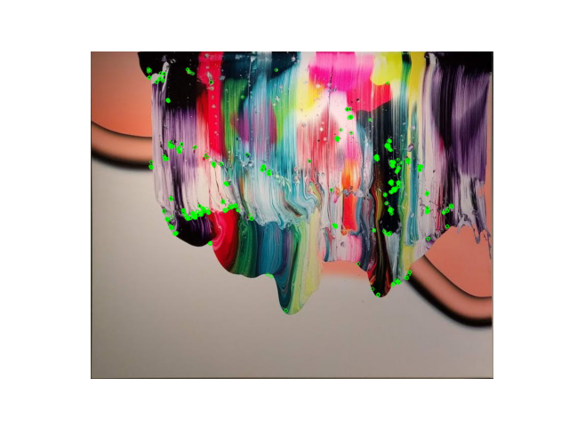

# Master in Computer Vision, Module C1
## Final presentation
You can view the slides for this project's final presentation via this [link](https://docs.google.com/presentation/d/1nmIMdjG88srY2hJZFuT2wO06Ag9B39kvTH5pKnxS3F8/edit?usp=sharing).

# Week 4
[▶️ Code execution](#code-execution)

[💡 This week's tasks](#this-weeks-tasks)
- [Task 1](#task-1)
- [Task 2](#task-2)
- [Task 3](#task-3)
- [Task 4](#task-4)

[📂 Files in this project](#files-in-this-project)

<h2 id="code-execution">▶️ Code execution</h2>

### Clone the repository
```
git clone https://github.com/MCV-2024-C1-Project/Team7
```

### Move to the corresponding directory
```
cd Team7
```

### Install dependencies
```
pip install -r requirements.txt
```

### Organize datasets
Even though different locations can be specified, in general the scripts assume a specific structure. To make sure everything works as expected, please create a folder named ``data`` at the top level of the repository. Then, place the datasets ``BBDD``, ``qsd1_w4`` and ``qst1_w4`` inside the folder ``data``.

### Run the main code

To generate the submissions for this week, **1 executable file** has been created: `generate_submission.py`.

This file executes the main function created (`get_predictions()`) with the best keypoint-descriptor combination as well as the best parameters. To execute this file, please do the following:
```
python generate_submission.py \
--query-dir "./data/qst1_w4/" \
--bbdd-dir "./data/BBDD/"
```

For more information on the methods used in this file, see the following sections.


<h2 id="this-weeks-tasks">💡 This week's tasks</h2>

This week, the retrieval of the paintings must be done using keypoint detectors and local descriptors. Our approach to solve this task consists os several studies:
1. **Testing** of the different keypoint detection and local description **methods**.
2. Study of the different **matching methods** for the descriptors.
3. **Optimization** of the **threshold** to detect **unknown paintings** for different keypoint detection and local description methods.
4. Study of how the **noise** can affect the performance of the keypoint detection and local description matching methods.

### Task 1

This task consists of the implementation of the keypoint detection and local description methods.

#### Testing of the different keypoint detection and local description methods and study of the different matching methods for the descriptors

We have suggested two different detectors to solve this problem:
- **Harris corner detector:** identifies corners using local intensity changes, creating stable rotationally invariant points, but not invariant in scale.
- **Harris Laplacian:** adds scale invariance to Harris corner detector by applying a Laplacian of Gaussian filter.

Many options are available to compute local description. In our case, we have used the ones listed below.
- **SIFT:** detects keypoints invariant in scale and rotation, then creates descriptors based on the gradient of the region around the keypoint.
- **ORB:** combines the FAST keypoint detection with the descriptor BRIEF with improvements to get rotational invariance and selecting the most descriptive keypoints.
- **AKAZE:** uses a non-linear scale space and binary descriptors, making it highly efficient and resilient to changes in lighting and contrast.

However, the implementation of SIFT, ORB and AKAZE also allows us to both detect the keypoints and to compute the local descriptors. For this reason, the previous 5 methods result in a total of 9 combinations, as shown in the following figure:

  

 Two different matching methods were used, resulting in a total of 18 combinations:
 - **Brute Force:** A descriptor of the first image is compared with all the descriptors in the other image using a distance. The closest one is returned. Using OpenCV BFMatcher function. To check whether the matches were correct, **Cross Check** method was used (the matches are checked bidirectionally: a match of two descriptors A and B is good only if B is the closest to A, and A is the closest to B).
 - **FLANN:** More efficient than Brute Force for large datasets / high dim descriptors. Finds approximately close matches. Different search methods available. Using OpenCV FlannBasedMatcher. In this case, the goodness of the matches was checked using **Lowe's ratio** (as described in D. Lowe SIFT paper: compares closest (M1) and second-closest (M2) match for each keypoint, calculating the ratio M1/M2 then using a threshold to decide).

The performance of each combination was evaluated using mean average precision at `K=1`and `K=5`. The results are shown below.

  

### Task 2

This task is divided into three sub-tasks. In this section, we describe the task and present our solutions.

1. **Tentative Match Identification and Verification:**

The first part of Task 2 involves identifying matches between image keypoints, based on the similarity of their descriptors.

**Matching Methods Explored**
To identify matching features across images, we explored and tested two main descriptor-matching methods:

- **Brute Force (BF) Matching**: This method compares each descriptor from the query image against all descriptors in the reference image. We used OpenCV’s BFMatcher, with the distance metric:
    - **For SIFT**: Since SIFT descriptors are 128-dimensional float vectors, Euclidean distance is appropriate as it measures closeness in vector space.
    - **For ORB and AKAZE**: Since these produce binary descriptors, Hamming distance is better suited as it is optimized for binary data comparisons.

- **FLANN (Fast Library for Approximate Nearest Neighbors)**: This method is more efficient for large datasets and high-dimensional descriptors. We used OpenCV's FlannBasedMatcher, with the search methods:
    - **For SIFT**: k-d Tree, recursively dividing the space, finding approximate matches in 𝑂(log(𝑛)).
    - **For ORB and AKAZE**: LSH (Locality Sensitive Hashing) binary descriptors, organizing descriptors into "groups" for more efficient matching than exhaustive search.

**Key Insight**: FLANN produced fewer high-quality matches compared to Brute Force, particularly for ORB and AKAZE. This aligns with expectations and can be interpreted as FLANN matches being of “less quality”.

**Performance Visualization:**


**Match Verification Methods**
After detecting and matching the keypoints, we verified that they were good matches by implementing and testing two different methods: **Cross Check** (for Brute Force only), or **Lowe’s ratio** (for Brute Force or FLANN). These methods are explained next:

- **Cross Check (only for Brute Force)**: The matches are checked bidirectionally: a match of two descriptors A and B is good only if B is the closest to A, and A is the closest to B. This was enabled by setting the `crossCheck` parameter to _True_ in the BFMatcher function. Cross Check significantly reduced matches, indicating stricter criteria for a match.

- **Lowe’s Ratio Test (for both Brute Force and FLANN)**: As proposed in Lowe’s SIFT paper, this test compares the closest match (M1) and the second-closest match (M2) for each keypoint. The ratio 𝑀1/𝑀2 must be below a threshold to be considered a good match. This test was implemented manually, yielding a highly selective set of matches.


2. **Detecting Unknown Queries**
The second part of Task 2 focuses on implementing a system to identify query images that do not match any reference image in the dataset (unknowns). This is essential for improving retrieval accuracy by preventing false matches to images outside the database.

**Steps to detect an unknown painting**:

- **Step 1**: For a given query, get the list of the number of matches with every database image.
- **Step 2**: Compare the top 1 and top 2 number of matches by calculating the ratio between them: `top2/top1`.
- **Step 3**: The ratio ranges from 0 to 1. The closer to 1, the more similar the number of matches between the top 1 and top 2, which means the system can’t clearly decide, which in turn likely means that the painting is unknown. Therefore, the ratio is tested against a predefined threshold.
- **Step 4**: If the ratio is above the threshold, the painting is flagged as unknown ([-1]).

**Threshold Optimization Study**:

- The threshold is optimized using QSD1 from W4. To check the variability of the optimum found, this optimization will be repeated for different keypoint descriptor methods: ORB + BF + CrossCheck, AKAZE + BF + CrossCheck, and HarrisLap. + ORB + BF + CrossCheck.

- To make the optimization faster, each keypoint descriptor method is only executed once, extracting the matrix with all the number of matching descriptors for every pair query-database_image.

- This matrix is used to test 9,999 different thresholds, going from 0.0001 to 0.9999. For each threshold, the steps shown above are executed for all queries, producing a binary vector of predicted unknown paintings.

- The vector of predictions is then compared to the ground truth, only considering whether or not the painting is actually unknown. This produces an F1 score.

- The F1 score is used to decide which of the 9,999 thresholds is best.

**Study Results**:

| Key-Des Method               | Best Threshold | F1 Score |
|------------------------------|----------------|----------|
| **ORB + FLANN + Lowe's**      | **0.5062**     | **0.870**|
| ORB + BF + CrossCheck        | 0.9281         | 0.800    |
| AKAZE + BF + CrossCheck      | 0.8686         | 0.690    |
| HarrisLap + BF + CrossCheck  | 0.8345         | 0.714    |

**Observations About the Results**:

- The best threshold does indeed change depending on the keypoint descriptor method used.
- The F1 scores are also different for the different keypoint descriptor methods used, suggesting that some methods detect “more distinct” keypoints, easing the unknown painting detection. In this case, **ORB + FLANN + Lowe** would produce the most distinct ones.
- We might expect even more dissimilar results for other descriptor matching and verification methods.

3. **Performance Comparison of Descriptor Matching Methods**

To determine the best descriptor matching method, we compared the MAP@1 scores and execution times for Brute Force and FLANN across different keypoint descriptor methods. In the following bar plots for the results obtained, we can observe that:


- **ORB → FLANN** outperforms Brute Force by 1.57x in MAP@1, and is 2.85x faster.
- **AKAZE → FLANN** is 14.42x better in MAP@1, and 4.54x faster.
- **Harris-Lap-ORB → Performance between BF and FLANN** is almost identical in terms of MAP scores (with no significant difference), but FLANN is still 1.05x faster.

**Conclusion**: FLANN was generally the superior matching method in terms of both speed and accuracy, especially for ORB and AKAZE descriptors.

**Comparative Analysis of FLANN Parameter Settings**

To further optimize FLANN’s performance, we evaluated various parameter settings. The parameters examined include Table Number, Multi Probe Level, Key Size, and Lowe Ratio. Each parameter affects both accuracy and computation time. Based on the plots, the effect is explained after the description of each method:


- **Table Number**:
    - *Description*: Number of hash tables; more tables improve accuracy but increase memory use.
    - *Effect*: Increasing Table Number improved MAP@1 by approximately 0.03 but nearly tripled computation time.

- **Multi Probe Level**:
    - *Description*: Number of nearby hash bins to search in addition to the primary bin; higher values boost accuracy but slow queries.
    - *Effect*: A higher Multi Probe Level improved MAP@1 by around 0.02, with a 20-30% increase in computation time.

- **Key Size**:
    - *Description*: Length of binary keys; longer keys improve accuracy and reduce speed.
    - *Effect*: Decreasing Key Size led to a MAP@1 gain of around 0.03, but more than doubled the computation time.

- **Lowe Ratio**:
    - *Description*: Threshold ratio to filter out poor matches by comparing the two best match distances; lower values give stricter filtering for better matches.
    - *Effect*: Lowering the Lowe Ratio improved MAP@1 by approximately 0.04 with minimal impact on computation time, making it a particularly effective adjustment.

**Optimal Parameter Configuration**

Based on these analyses, the best-performing parameter combination chosen for FLANN was:
- Table Number: 6
- Multi Probe Level: 1
- Key Size: 12
- Lowe Ratio: 0.8

This configuration achieved a balance of high MAP@1 scores and efficient execution time, making it ideal for tasks involving large datasets and complex matching requirements.

### Task 3

In this task, we must evaluate our system on this week's dataset. Moreover, we are asked to evaluate last week's query system on this new dataset and compare their performances. First, we decided to do an additional study you will find below.

### Additional study: how does noise affect the different keypoint descriptors methods?

This study investigates how noise affects the performance of two keypoint detection and descriptor methods, ORB and AKAZE. Using the FLANN matching method, we analyze each method’s robustness under both noisy and noise-free conditions, with performance evaluated through MAP@1. Therefore, the experiment setup is the following:

1. **Conditions**: Keypoint detection and descriptor methods: **ORB** and **AKAZE**. We also used **FLANN matching** to assess performance, which was the best matching method. This methods are used for both noisy and _clean_ images.

2. **Noise Type in Dataset**: We used the qsd1_w3 dataset, which contains two types of synthetic noise:
    - **Salt-and-Pepper Noise**: Disrupts pixel intensities randomly, creating sharp, contrasting points.

     

    - **Color Noise**: Introduces subtle color shifts that can affect pixel values across different channels.

     

3. **Performance Evaluation**: We used MAP@1, Mean Average Precision at k=1, scores to evaluate the results.

**Visual Insights**
- Keypoint detection in noisy vs. clean images:
    - Salt-and-Pepper noise:

     


    - Color noise:

     
     

- Bar plot:
The bar plot compares the MAP@1 performance of AKAZE and ORB with the FLANN matching method, with separate bars for "No Noise" and "Noise".


**Findings on Noise Impact:**
- **Keypoint Detection**:
    - Salt-and-Pepper Noise: This type of noise often introduces false keypoints, as random pixel spikes are detected as features.
    - Color Noise: Minimal impact on keypoint detection unless significant intensity changes occur, which can shift keypoint locations slightly.
- **Descriptors**:
    - Salt-and-Pepper Noise: Creates distortion in descriptors, reducing reliability as it disrupts the local structure needed for accurate matching.
    - Color Noise: No impact on descriptors, as ORB and AKAZE both rely on grayscale intensity rather than color data.
- **Matching Process**:
    Noise disrupts both keypoint detection and descriptor accuracy, leading to a higher rate of mismatches.

In summary, while noise does degrade the retrieval system’s performance, its impact is not severe for either method under the tested conditions, with ORB showing slightly more sensitivity to noise than AKAZE. The effect it has on MAP@1 for each method is:
- **AKAZE: MAP@1 drops by 0.04 with noise.**
- **ORB: MAP@1 sees a more substantial drop of 0.1.**

### Task 4

In Task 4 we must generate and submit the results for a "blind" competition using our final retrieval system.

To generate the submission, it is only necessary to execute the `generate_submission.py` script as specified at the beggining. This script is already configured with the best methods and parameters, so it is only necessary to specify the image folders.

<h2 id="files-in-this-project">📂 Files in this project</h2>

#### Submission file
The submission file is `generate_submission.py`, and can be executed as specified at the beggining.

#### Main function file
The main function created this week, `get_prediction()`, can execute any of the 9 combinations of keypoint-descriptor methods explained earlier. This function can be found in the `get_prediction.py` file.

#### Study files
For the different studies that have been performed, there are several notebooks available:
- Model comparison study: 
