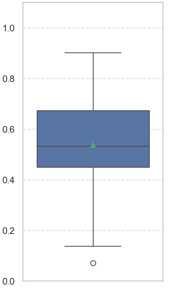
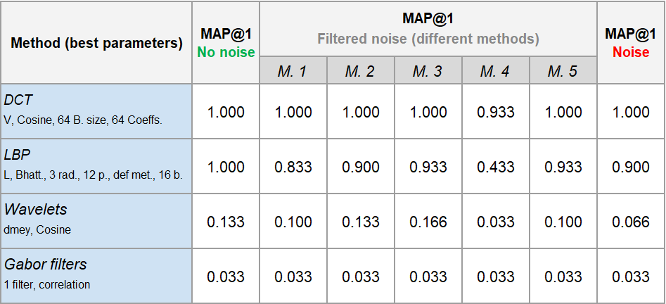

# Master in Computer Vision, Module C1
# Week 3
[▶️ Code execution](#code-execution)

[💡 This week's tasks](#this-weeks-tasks)
- [Task 1](#task-1)
- [Task 2](#task-2)
- [Task 3](#task-3)
- [Task 4](#task-4)

[📂 Files in this project](#files-in-this-project)

<h2 id="code-execution">▶️ Code execution</h2>

### Clone the repository
```
git clone https://github.com/MCV-2024-C1-Project/Team7
```

### Move to the corresponding directory
```
cd Team7
```

### Install dependencies
```
pip install -r requirements.txt
```

### Organize datasets
Even though different locations can be specified, in general the scripts assume a specific structure. To make sure everything works as expected, please create a folder named ``data`` at the top level of the repository. Then, place the datasets ``BBDD``, ``qsd1_w3``, ``qsd2_w3``, ``qst1_w3`` and ``qst2_w3`` inside the folder ``data``.

### Run the main code

To generate the submissions for this week, **2 different executable files** have been created.

1. For the predictions for the images without background (**QST1_W3**), please execute `generate_sumbission_cropped.py` as is indicated next. In this file, the best denoising and best texture methods have been used.

```
python generate_submission_cropped.py \
--queries-dir "./data/qst1_w3/" \
--bbdd-dir "./data/BBDD/"
```

2. For the predictions for the images with background (**QST2_W3**), as well as the corresponding masks, please execute `generate_submission_background.py` as is indicated next. In this file, the best denoising and best texture methods have been used, as well as a method to detect and extract the paintings present in each image.

```
python generate_submission_background.py \
--queries-dir "./data/qst2_w3/" \
--bbdd-dir "./data/BBDD/"
```

For more information on the methods used in these files, see the following sections.


<h2 id="this-weeks-tasks">💡 This week's tasks</h2>

This week we must tackle three distinct challenges:
- Some images might contain noise (random samples or hue changes), so we must filter the noise (**Task 1**).
- We can only use texture descriptors to compare and retrieve images (**Task 2**).
- Given an image, we must detect the paintings present in the image (1 or 2), then remove the background (**Task 3**).

At the end, the different methods to solve these challenges will be combined in a single pipeline, going from a raw, noisy image with one or two paintings, to the predictions corresponding to those paintings (**Task 4**).

### Task 1

In **Task 1**, our objective is to identify and filter noise in images effectively. The challenge is addressed in two main phases: **Noise Estimation** and **Denoising**.

### Noise Estimation

Since only some images contain noise, selective denoising is necessary to avoid introducing unwanted artifacts. We evaluated four noise estimation methods:

1. **Variance**: Measures pixel intensity spread; useful for general noise but may miss isolated salt-and-pepper noise.
2. **Wavelet-based Estimation**: Captures localized noise by isolating high-frequency components, effective for detecting salt-and-pepper noise.
3. **Laplacian Filter**: Detects noise by emphasizing pixel intensity changes, ideal for sharper noise patterns like salt-and-pepper.
4. **Entropy**: Measures pixel randomness; effective for some noise but may mistake texture as noise due to high detail.

#### Findings

- The **Laplacian method** was determined to be the most reliable, with a significantly higher correlation to actual noise compared to the other methods.
- **Optimal threshold for noise detection**: Based on ROC analysis, a threshold of **38.56** provides the best balance, detecting the noisiest images without overestimating noise in clean images.

### Denoising Methods

With noise estimation in place, we focused on testing and optimizing various denoising techniques. We explored **Low Pass Filters, Wavelet Filters, Laplacian Pyramids**, and **DCT Filters**, comparing their performance in terms of detail preservation and noise reduction. The techniques and configurations tested include:

1. **Gaussian Blur**: Smooths noise but can blur edges.
2. **Median Blur**: Effectively removes salt-and-pepper noise, ideal for sharp artifacts.
3. **Bilateral Filter**: Maintains edges while reducing noise.
4. **Non-Local Means (NLM)**: Reduces noise by averaging similar patches, preserving fine details.
5. **Wavelet Filter**: Decomposes the image, enabling selective denoising on different frequency components, effectively retaining structural details.
6. **Discrete Cosine Transform (DCT) Filter**: Converts the image to the frequency domain, isolating low-frequency components for denoising. However, since DCT is best suited for periodic noise, might not perfmorm too good in this case.
7. **Laplacian Pyramids**: Utilizes multi-scale decomposition to apply low-pass filters(1. to 4.) at different pyramid levels, allowing for targeted denoising while preserving edges. This approach helps maintain structural integrity in images by reducing noise without excessive smoothing.

The box plots below compare the performance between the studied denoising methods. The similarity score is computed betwwen the denoised images and the ones without noise (ground truth).





Additionally, we explored **enhancements** to these filters:
   - **High-pass Filtering**: Applied after denoising to enhance edges.

The following box plot shows the impact of High-Pass filtering on the similarity between the denoised images and the ground truth images.


#### Key Insights from Denoising

- **Gaussian Blur** and **Wavelet Filtering** showed the highest performance in terms of noise reduction and structural preservation.
- High-pass enhancement generally had minimal effect and occasionally reduced lower quartile values, suggesting limited improvement.
- The **Laplacian Pyramid** approach, when combined with low-pass filters, sometimes amplifies noise, giving worts results than applying the same filters without pyramid.

#### Selected Methods for Final Pipeline

From these findings, we selected the following configurations as the bests ones or more intreresting ones to further test:

- **Method 1**: Gaussian Blur (`ksize = 3x3`), applied to all images without enhancements.
- **Method 2**: Gaussian Blur (`ksize = 3x3`) with high-pass enhancement.
- **Method 3**: Gaussian Blur (`ksize = 3x3`), applied only if noise estimation exceeds threshold (Laplacian threshold = 38.56).
- **Method 4**: Gaussian Blur with **3 levels Laplacian Pyramid** application and high-pass enhancement, applied to all images.
- **Method 5**: **Wavelet Filter** (`wavelet='db1'`, `level=1`, `thresholding='soft'`), effective for preserving image structure, applied to all images.


### Task 2
In Task 2, we must develop and test one or more methods to extract texture descriptors from the images. We should do the feature extraction using strictly texture descriptors only, and it is suggested we use LBP, DCT or wavelet-based methods for this purpose. 

To adress this task, we have decided to study and test four different approaches: **LBP**, **DCT**, **Wavelets** and **Gabor filters**. For each of these approaches, using the clean QSD1_W3 dataset, we have studied different parameter combinations and preprocessing techniques. Then, we have analized the results and selected the best variant of each approach. At the end, we have also tested these variants with the noisy QSD1_W3 dataset, as well as with all the noise-filtered versions of this dataset, corresponding to the 5 denoising methods developed in Task 1. This way, we also have been able to assess how these approaches react to the presence of noise. Next, we explain in more detail each approach.

#### DCT

At the heart of this approach, the `dct()` function from **OpenCV** has been used. As additional preprocessing, we have considered changing the color space, splitting the image into different blocks, and rescaling to 256x256 for computational reasons as well as to simplify the process of splitting into blocks.

A total of **360** different parameter combinations have been tested. They are the following:
- **Color**: gray, L (from CIELAB), V (from HSV)
- **Block size**: 256x256, 128x128, 64x64, 32x32, 16x16, 8x8
- **Number of relevant coefficients**: 64, 32, 16, 8, 4
- **Distance measure**: Cosine similarity, Pearson correlation, L1, L2

Here is the distribution of the scores obtained for all combinations:


Next are the highlights after analyzing the results:
- The V color channel performs better on average than the other color channels.
- The Cosine/Pearson distances perform significantly better on average than L1 and L2
- Very high or very log dimensional feature vectors perform bad on average.
- Out of the 360 different combinations, 30 of them have perfect scores (MAP@1 and MAP@5 both equal to 1).
- The best variant corresponds to: *using V channel, Cosine distance, block size of 64, 64 relevant coefficients* (see DCT results analysis for more information on this decision).

Additionally, an interesting thing to analyze is how the dimension of the final feature vector affects performance on average. The following is a plot that illustrates this, showing that more dimensions past a certain point decreases performance.


#### LBP

The core of this approach is the `local_binary_pattern()` function from Scikit-image. Just like in the DCT approach, we have changed the color, splitted the image into different blocks and resized the image (in this case, because LBP is strongly dependent on resolution).

A total of **324** different parameter combinations have been tested. They are the following:
- **Color**: gray, L , V
- **Number of blocks**: 64, 16, 4, 1
- **(Radius, Points)**: (1, 8), (2, 10), (3, 12)
- **Calculation method**: "default", "ror", "uniform"
- **Distance measure**: Bhattacharyya, Correlation, Intersection
The multi-resolution LBP approach has also been tested (concatinating all three combinations of raidus/points pairs), but the results are similar to the best results found with the single-resolution approach, although higher dimensional.

Here is the distribution of the scores obtained for all combinations:


Next are the highlights after analyzing the results:
- The L color channel performs better on average, although not by much.
- The more blocks that are used, the better the results (on average).
- The defualt calculation method is much better. We believe this is because the "ror" method (roation invariant) produces sparse vectors (as processed with our functions), and thus distances cannot be properly calculated with them. On the other hand, the uniform method has been designed to be fast to compute, so the information is (in our case) too compressed (the feature vectors are low dimensional).
- The best variant corresponds to: *using the L channel, Bhattacharyya distance, radius of 3 together with 12 neighboring points, and using the default calculation method* (see LBP results analysis for more information on this decision).

One of the most influential parameters has been the number of blocks. Here is a plot showing this influence, representing the distribution of MAP@1 scores for different numbers of blocks:


#### Wavelets

For this aproach the main library for the methods has been PyWavelet and the function `dwt2`, the used wavelets have been one of each type in the discrete family of wavelets that the library has. The procedure follows a similar path at the start as the other two before, first taking the image and then extracting the channels that are of interest, after this common path it diverges, the wavelet coefficients are extracted and then passed through a PCA on both dimensions to reduce dimensionality and obtain the same size on all images, after this the image is flattened to a vector. When using the RGB image as the `dwt2` returns two coeffs. for pixel the magnitude has been computed to extract only one value for pixel.

A total of **336** different parameter combinations have been tested. They are the following:
- **Color**: RGB, gray, V (HSV), L (CIELAB)
- **PCA**: 100 (RBG), 50 (gray, V, L)
- **Wavelets**: bior, coif, db, dmey, haar, rbio, sym
- **Directions**: Vertical, Horizontal, Diagonal
- **Distance measure**: L1, L2, Pearson correlation, Cosine Similarity

From this execution the one that gave the best results was the RGB, with a `MAP@1` of 0.133. On this case we can observe that on the best 20 results the vertical wavelet appears more than twice the times that the diagonal apears. 


And with a complete observation and statistics extraction of the results with the RGB methods we can see how the vertical dominates the rest of directions with a greater mean and maximum.
| Direction  | Mean  | STD   | min | max  |
|------------|-------|-------|-----|------|
| Diagonal   | 0.007 | 0.014 | 0   | 0.033 |
| Horizontal | 0     | 0     | 0   | 0    |
| Vertical   | 0.057 | 0.06  | 0   | 0.133 |

#### Gabor filters

This filters aproach has required the use of OpenCV function `getGaborKernels`. The main idea in this one is to try a simpler method to see how it works; the pipeline consists in a grayscale extraction of the image, then the application of the gabor filters and finaly the histogram extraction. 

A total of **36** different parameter combinations have been tested. They are the following:
- **Number of angles**: 1, 2, 4, 8, 16, 32
- **Distance measures**: Correlation, Chi-Square, Intersection, Bhattacharyya, Hellinger, Kl-divergence
  
From this aproach the results obtained did not raise from an `MAP@1` of 0.33, and the apperances of the diferent distances and number of angles did not show any tendency more than the best results were given by the correlation and intersection measurements. However it must be said that gabor gives a great visual description of what the filters detected on the image as we can see on the next images: 

Original image             |  Gray Gabor image
:-------------------------:|:-------------------------:
  |  

#### Studying how the presence of noise affects performance

To analyze how noise affects peformance, the best variants of all four methods have been tested not only with the clean QSD1_W3 dataset (which is the one used to perform the studies), but also with the noisy QSD1_W3 dataset, as well as with 5 different versions of denoised datasets (see Task 1 for more info on the denoising methods). The results are shown in the following table:



Analyzing the results, the following comments can be made:
- The best approach is clearly DCT.
- The aproaches that use image splitting give better results than the ones that do not.
- DCT doesn't show decreased performance even when dealing with noisy images.
- In general, model performance decreases when dealing with noisy or denoised images.
- In general, model performance increases when denoising is applied, with respect to using the non-denoised dataset.
- The best denoising methods are number 3 and number 5
- Method number 4 makes performance worse than without removing the noise.


### Task 3
In Task 3, we must be able to detect all the paintings in an image, then extract those paintings, effectively removing the background. In addition, a binary mask must be created so the developed method can be evaluated.

The chosen method for this segmentation task consists of several steps:

1. Gaussian denoising
2. Canny edge detection
3. Closing
4. Two largest contour filling with Convex Hulls
5. Erosion
6. Removing small polygons (if there are any)

The following figure shows an example of the results after applying each of the steps of the segmentation pipeline over a sample (step 6 is not shown, as the outcome is the same as in step 5).


### Task 4
In Task 4, we must combine all the previous methods, so that we can go from a raw, noisy image to the predictions for the paintings found in the image. The file `generate_submission_background.py` computes the steps described in tasks 1, 2 and 3 in a single pipeline, generating the top K predictions for each of the queries.

<h2 id="files-in-this-project">📂 Files in this project</h2>

Here you can find a brief description of the most relevant files and functions that we created to solve this week's tasks. They will be divided into different sections, corresponding to the main tasks of this week.

### Noise removal related files

- `denoising.ipynb`: Notebook structured into three key sections:
  - Noise Estimation: Analyzes methods to determine image noise levels, identifying the most effective of four approaches and the optimal threshold for it. Includes PR and ROC curve evaluations.
  - Denoising Methods Exploration: Conducts an exploratory analysis of various denoising methods, including a grid search for optimal parameters per method. The study includes performance comparisons and visual results, covering Low Pass filters, combinations of Low Pass filters with Laplacian pyramid levels, Wavelet filters, and DCT filters.
  - Denoised Dataset Generation: Provides a function to generate a denoised dataset using any implemented method with custom parameters and combinations, such as optional high-pass enhancement or applying denoising only when noise estimation exceeds a specified threshold.


### Texture extraction related files

For the DCT approach, there are 3 different files of interest:
- `DCT_study.py`: executes the parameter grid and saves the results in a csv file.
- `DCT study - results analysis.ipynb`: analyzes the results csv with plots and other calculations.
- `DCT study - example visualization`: visually represents how the texture features of an example image are extracted, using the best variant of the DCT approach.
- Other helper functions have been defined and distributed in different utils files, most notably in the `DCT.py` utils script.

For the LBP approach, similarly to the DCT approach, there are 3 different files of interest:
- `LBP_study.py`: executes the parameter grid and saves the results in a csv file.
- `LBP study - results analysis.ipynb`: analyzes the results csv with plots and other calculations.
- `LBP study - example visualization`: visually represents how the texture features of an example image are extracted, using the best variant of the DCT approach.
- Other helper functions have been defined and distributed in different utils files, most notably in the `LBP.py` utils script.

For the Wavelets approach theere are 3 files of interest:
-`apply_wavelet`: executes the parameter grid and saves the results in different csv files.
-`texture_descriptors_tries`: contains example images and basic filter using.
-`wavelet_and_gabor_results`: does a small analisis of the results obtained after applying the wavelet.

For the Gabor filters approach theere are 3 files of interest:
-`apply_gabor_filters`: executes the parameter grid and saves the results in different csv files.
-`texture_descriptors_tries`: contains example images and basic filter using.
-`wavelet_and_gabor_results`: does a small analisis of the results obtained after applying the gabor filters.

### Painting detection and background removal related files
- `week3_crop_images.py`: this script processes all the query images in a directory according to the pipeline described in task 3. It returns the cropped images and the corresponding masks.
- `segmentation_week3.ipynb`: this is the notebook where the tests for the segmentation task were developed.

### Full pipeline related files

The execution of all methods combined in a single pipeline happens in the `generate_submission_background.py` file, where the best approaches identified for image segmentation, noise removal and texture extraction have been used. This is also the file that generates the sumbission for the QST2_W3 dataset, as explained at the begginning of this report.

The pipeline for already cropped images, only using noise removal and feature extraction, is encapsulated in the `generate_submission_cropped.py` file. Again, this is also the file that generates the submission for the QST1_W3 dataset.

